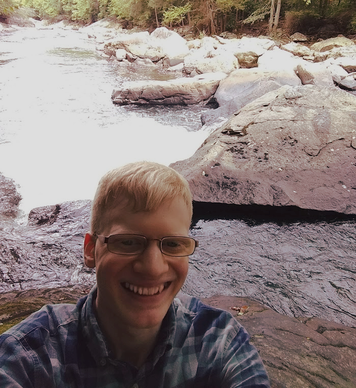

 I am a PhD candidate in Neural Computation at Carnegie Mellon University studying in the labs of Aryn Gittis (CMU Biology) and Jonathan Rubin (Pitt Mathematics).  Throughout my PhD, I've investigated the generation and propagation of pathological brain waves in Parkinson’s disease using electrophysiology and statistical and biophysical modeling techniques.  In my work as a computational neuroscientist, I aim to draw simple and meaningful conclusions about complex systems through the careful and clever analysis of data. I'm seeking to apply these skills to a wide range of challenging and impactful problems.

Read more about my background on my [about](../about) page, or learn about some of the work I've done in my [publications](../publications) or [projects](../projects)

Looking to get in touch? Reach out at [tim@timcwhalen.com](mailto:tim@timcwhalen.com).