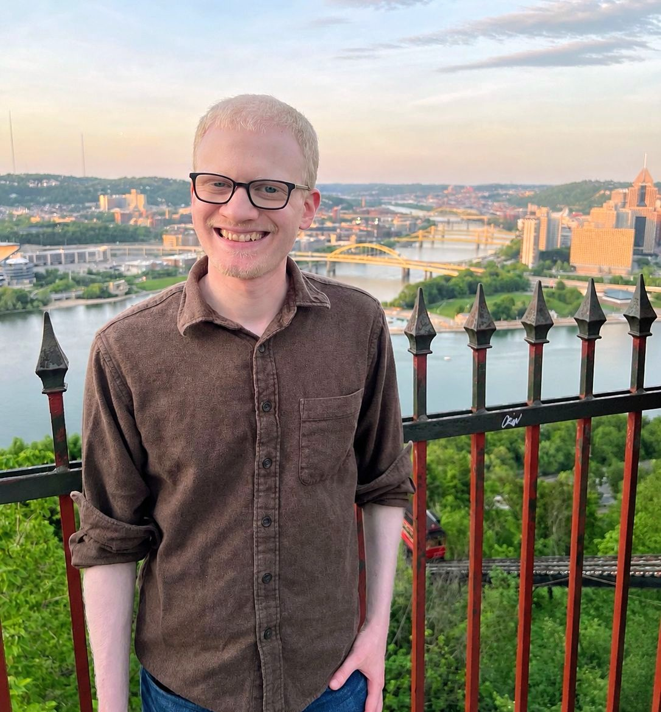

{: style="display:block; margin:0 auto 10px auto; width:100%; max-width:625px;" }

I'm a **Senior Data Scientist** at International Flavors and Fragrances (IFF). I build and serve as a **digital product owner** for internal data products that help our perfumers, flavorists, design managers, and commercial teams to be more effective in their work serving our customers. I collaborate directly with internal stakeholders to understand their challenges, determine their precise data and modeling requirements, iterate on AI/ML solutions with their feedback, and lead teams in developing, deploying, and continuously improving internal web applications. I've also contributed to digital transformation initiatives at our production facilities focused on operational efficiency, waste reduction, and product quality.

Prior to my role at IFF, I:
- Worked as a **Data Scientist and DS/ML Portfolio Manager** for Design interactive, where I led our portfolio of computer vision, predictive maintenance, and time series forecasting products for government and commercial customers. I worked with customers to define technical requirements and secured millions of dollars in grant funding for innovative projects across the DOD, DOT, and DOE. I held a U.S. Secret Security Clearance for this role.
- Earned my **Ph.D. in Neural Computation** at Carnegie Mellon University. I designed and conducted electrophysiological experiments and built statistical and ML models to study the generation and propagation of pathological brain waves in Parkinson's disease and their causal relationship to motor dysfunction. I was awarded an NIH F-31 Predoctoral Fellowship and the Nora Volkov Carnegie Prize for this research., and you can learn more about this work in my [publications](../publications) or [projects](../projects) pages.

I live with my wife, Vanessa, and our three cats (Misty, Mr. Fish and Zee) in beautiful Pittsburgh, PA. I love to travel, especially to Japan where Vanessa and I celebrated our honeymoon. I also play guitar, watch (and used to perform) improv comedy, and play overly complex Euro-style economic board games

Looking to get in touch? Reach out at [timcwhalen@gmail.com](mailto:timcwhalen@gmail.com).